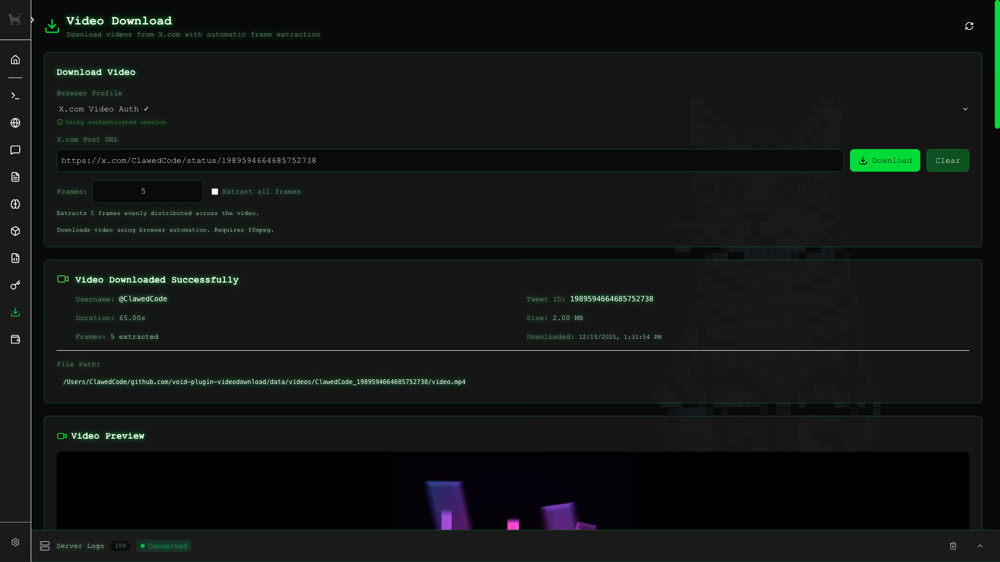

# void-plugin-videodownload

Download videos from X.com (Twitter) with automatic frame extraction for LLM analysis.



## Features

- Download videos from X.com posts
- Configurable frame extraction (set specific count or extract all frames)
- Uses browser profiles from void-server core for authentication
- Video preview and frame gallery in the UI
- Video metadata extraction (duration, file size, tweet info)

## Requirements

- **void-server** with browser management enabled
- **ffmpeg** - Required for video downloading and frame extraction
  ```bash
  # macOS
  brew install ffmpeg

  # Ubuntu/Debian
  sudo apt install ffmpeg

  # Windows
  choco install ffmpeg
  ```

## Setup

1. Install the plugin in void-server's `plugins/` directory
2. Create a browser profile in the Browsers page
3. Launch the browser and log into X.com
4. Close the browser - your session is saved
5. Navigate to Video Download page and select your authenticated browser

## Usage

1. Select an authenticated browser profile from the dropdown
2. Paste an X.com post URL containing a video
3. Set frame count (or check "Extract all frames" for every frame)
4. Click "Download"

Downloaded videos and frames are displayed in the UI and saved to `data/videos/`.

## Privacy

- Your X.com credentials are stored locally in browser profiles
- No data is sent to external servers
- Downloaded videos are excluded from git via `.gitignore`

## API Endpoints

| Endpoint | Method | Description |
|----------|--------|-------------|
| `/api/video-download/download` | POST | Download video from URL |
| `/api/video-download/files/*` | GET | Serve downloaded videos/frames |

### Download Request

```json
{
  "url": "https://x.com/username/status/1234567890",
  "browserId": "browser-profile-id",
  "frameCount": 5
}
```

Set `frameCount` to a number for specific frames, `"all"` for every frame, or `0` to disable.

### Download Response

```json
{
  "success": true,
  "videoPath": "/path/to/video.mp4",
  "videoUrl": "/api/video-download/files/username_1234567890/video.mp4",
  "frames": ["/path/to/frame_1.jpg", ...],
  "frameUrls": ["/api/video-download/files/username_1234567890/frame_1.jpg", ...],
  "metadata": {
    "tweet_id": "1234567890",
    "username": "username",
    "duration_seconds": "65.00",
    "file_size_mb": "2.00",
    "frame_count": 5
  }
}
```

## License

MIT
